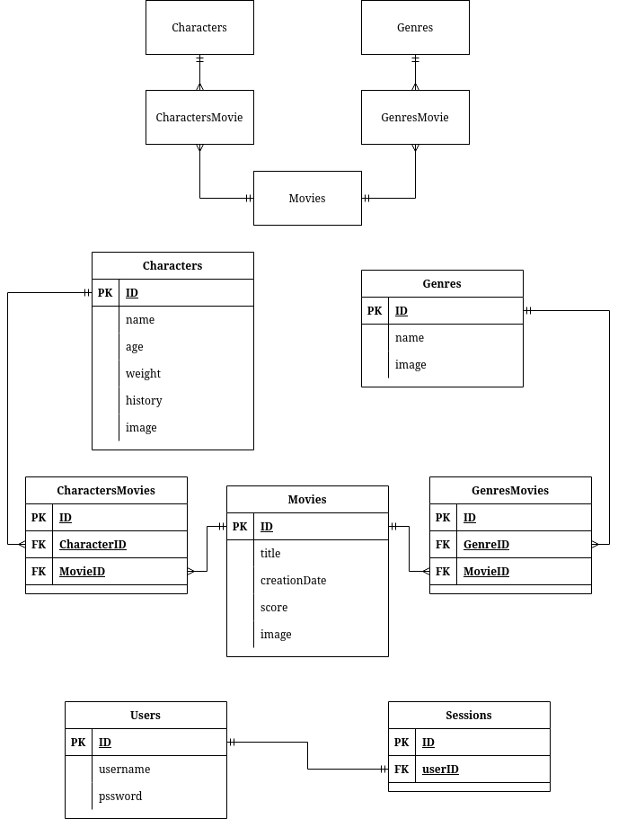

# Challenge Alkemy Disney

Desarrollar una API para explorar el mundo de Disney, la cual permitirá conocer y modificar los
personajes que lo componen y entender en qué películas estos participaron. Por otro lado, deberá
exponer la información para que cualquier frontend pueda consumirla.

## Diseño de base de datos



# Dependencias de Produccion

- [node v18](https://nodejs.org)
- [@sendgrid/mail v7.7.0](https://sendgrid.com)
- [bcrypt v5.1.0](https://www.npmjs.com/package/bcrypt)
- [cors v2.8.5](https://www.npmjs.com/package/cors)
- [express v4.18.1](https://expressjs.com)
- [express-winston v4.2.0](https://www.npmjs.com/package/express-winston)
- [multer v1.4.5-lst.1](https://www.npmjs.com/package/multer)
- [sequelize v6.24.5](https://sequelize.org)
- [sharp v0.31.1](https://www.npmjs.com/package/sharp)
- [sqlite3 v5.1.2](https://www.npmjs.com/package/sqlite3)
- [uuid v9.0.0](https://www.npmjs.com/package/uuid)
- [uuid-validate v0.0.3](https://www.npmjs.com/package/uuid-validate)
- [winston v3.8.2](https://www.npmjs.com/package/winston)

## Instalacion

```
 yarn install
 yarn run start
```
